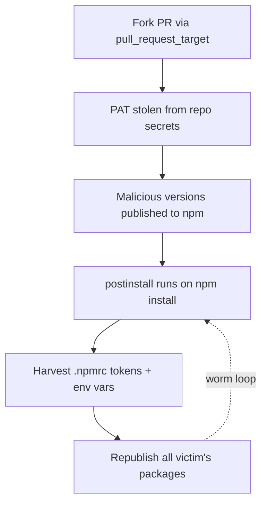
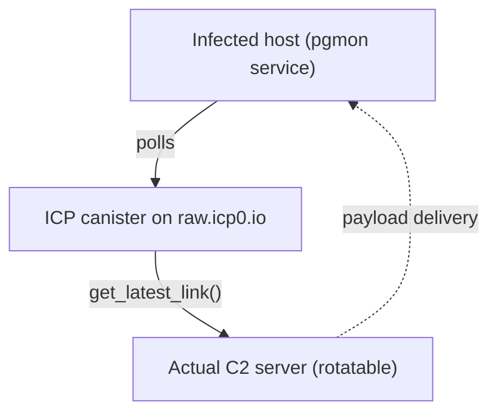

A couple of weeks ago, Aqua Security's Trivy, one of the most widely used open-source vulnerability scanners, got compromised. Not a minor CVE-in-a-dependency kind of compromise. A full-blown supply chain attack that turned the scanner itself into a distribution mechanism for credential-stealing malware.

The irony is almost poetic: a tool that millions of developers run to _detect_ vulnerabilities became the thing that _introduced_ one.

What followed was CanisterWorm, a self-propagating npm worm that used stolen credentials to infect downstream packages, spreading from one developer's account to the next without any manual intervention from the attacker. At last count, 141 malicious package artifacts across 66+ unique packages were compromised.

I've been spending time on this topic professionally as well. I wrote about [how to detect the exact GitHub Actions misconfiguration that enabled this attack](https://www.cloudquery.io/blog/detecting-github-actions-supply-chain-attacks-fork-pr-workflows) using CloudQuery. If you want the detection and remediation angle, that post goes deep into the querying side of things.

Here, I want to focus on the attack itself: how it happened, why it was so effective, and what the next iteration of this kind of attack might look like.



## How it started: a misconfigured workflow

The whole chain started with something deceptively mundane: a `pull_request_target` workflow in Trivy's GitHub Actions configuration.

Here's the thing about `pull_request_target`: unlike a regular `pull_request` trigger, it runs in the context of the _base_ repository, not the fork. That means it has access to the repo's secrets, write permissions, and any Personal Access Tokens configured in the workflow. It's designed for use cases where you need to comment on PRs or label them, actions that require base repo permissions.

The problem? If that workflow checks out the _fork's_ code and runs it, an attacker can submit a PR from their own fork containing arbitrary code that executes with full access to the target repo's credentials. That's exactly what happened.

TeamPCP, the threat group behind this, submitted a pull request that exploited this misconfiguration to steal a Personal Access Token. With that token, they gained publishing access to Trivy's npm packages: `trivy`, `trivy-action`, and `setup-trivy`.

One misconfigured workflow setting. That's all it took.

## The worm: how CanisterWorm propagates

Once TeamPCP had publishing access to Trivy's packages, they injected a malicious `postinstall` hook into the package.json:

```json
"scripts": {
    "postinstall": "node index.js"
}
```

If you've ever run `npm install`, you know what happens next. npm automatically executes lifecycle scripts. No prompt, no warning, no confirmation. The `postinstall` script runs silently in the background the moment you install the package.

The malicious `index.js` kicks off two parallel operations:

First, it scans for npm authentication tokens everywhere it can find them. `.npmrc` files in the project directory, the home directory, system-wide configs, and environment variables like `NPM_TOKEN`. If you've ever published a package, there's a good chance your token is sitting in one of those locations.

Second, and this is where it gets nasty, it self-propagates. A secondary script called `deploy.js` takes whatever npm tokens it found, queries the npm registry for every package the victim maintains, bumps the patch version of each one, injects the same malicious payload, and republishes. Every developer or CI pipeline that installs one of those newly-infected packages and has an npm token accessible becomes the next propagation vector.

**The result is exponential spread.** One compromised developer account can infect dozens of packages. Each of those packages might be installed by other developers with their own tokens, whose packages then get infected, and so on. The attack surface compounds with every cycle.

## The C2 infrastructure: why this was hard to kill

Most supply chain attacks use traditional command-and-control infrastructure: a domain or IP address that the malware calls home to. Take the domain down, and you cut the cord.



CanisterWorm did something different. It used an ICP canister, a smart contract on the Internet Computer blockchain, as a dead drop resolver. The backdoor polls a URL on `raw.icp0.io` to retrieve the actual C2 server address.

**This is significant** because blockchain-hosted infrastructure can't be taken down through traditional domain seizure or hosting provider takedowns. The canister supports methods like `get_latest_link` and `update_link`, meaning the attackers can rotate their C2 address at will without touching the malware itself.

On infected Linux systems, the malware establishes persistence through a systemd user service named `pgmon`, deliberately mimicking PostgreSQL monitoring tooling to avoid suspicion. It auto-restarts if terminated, runs on user login, and stores state in `/tmp/pglog` and `/tmp/.pg_state`.

Interestingly, the canister includes what appears to be a kill switch: when the resolved URL points to youtube.com (currently a rickroll), the malware pauses execution. As of writing, the C2 is dormant. But the infrastructure is still there.

## How this could have been prevented

There were several points where this could have been stopped:

| Issue | Fix |
|-------|-----|
| `pull_request_target` misconfiguration | Set fork PR approval policy to `all_outside_collaborators`; never checkout fork code in target workflows |
| Long-lived npm tokens | Use short-lived, scoped tokens with publish-only permissions; rotate regularly |
| Automatic lifecycle scripts | `npm config set ignore-scripts true` globally; allowlist trusted packages |
| No package provenance | Enable [npm provenance](https://docs.npmjs.com/generating-provenance-statements) to link published versions to their source repo and build system |

**The GitHub Actions misconfiguration** was the root cause. One toggle in repository settings would have prevented the initial compromise entirely. But even after the initial breach, scoped tokens would have limited the blast radius, disabled scripts would have broken the infection vector, and provenance attestation would have flagged the tampered packages before they reached anyone's `node_modules`.

## What comes next

Here's what concerns me about CanisterWorm: it's a template. Every component of this attack (the initial access via CI/CD misconfiguration, the credential harvesting, the self-propagation logic, the blockchain C2) is reusable and adaptable.

Other ecosystems are just as vulnerable. PyPI, RubyGems, crates.io: any package registry where publishing tokens are long-lived and stored locally is susceptible to a worm that harvests and reuses them. The npm-specific parts of CanisterWorm are trivial to adapt.

The initial compromise didn't come from phishing or a stolen laptop. It came from a GitHub Actions workflow. As more organizations move their build, test, and publish pipelines into CI/CD systems, those systems become high-value targets. A single compromised workflow can give an attacker access to publishing credentials, cloud provider tokens, database passwords. Whatever the pipeline touches. **CI/CD is the new perimeter**, and most teams haven't caught up to that reality.

Then there's the LLM angle, and it's worth spending time on because this is where things get genuinely uncomfortable.

TeamPCP has been identified as using AI-assisted tooling for parts of their operation. But CanisterWorm's `deploy.js` was still static code, a fixed script that followed the same logic on every hop. The next generation won't be.

Researchers at Cornell Tech and the Technion Institute built [Morris II](https://arxiv.org/abs/2403.02817), a proof-of-concept worm that propagates through GenAI ecosystems using adversarial prompt injection. It doesn't carry traditional malware payloads. Instead, it injects self-replicating prompts into RAG pipelines, hijacking AI agents into forwarding the infection to the next agent in the chain. Zero clicks required. In their tests, a single poisoned email made an AI assistant read, steal, and resend confidential messages across multiple platforms.

Separately, Zimmerman and Zollikofer demonstrated ["Synthetic Cancer"](https://arxiv.org/abs/2406.19570), a worm that uses LLMs for code metamorphism. Each time it replicates, it asks the LLM to refactor its own source code, producing a functionally identical but syntactically unique copy. Traditional signature-based detection becomes useless against something that literally rewrites itself at every hop.

These are academic proof-of-concepts today, but combining them with CanisterWorm's approach is a plausible evolution:

| | CanisterWorm (today) | LLM-augmented (plausible) |
|---|---|---|
| Payload | Same `postinstall` hook every time | Unique code per target package |
| Detection | Signature-based catches all copies | Each copy is syntactically different |
| Propagation | npm only | Cross-ecosystem (npm, PyPI, crates.io) |
| Social engineering | None | Context-aware commit messages, changelogs | An LLM-augmented supply chain worm wouldn't just inject the same `postinstall` hook into every package. It could analyze each target package's structure, generate payload code that blends in with the existing codebase, and adapt its propagation strategy based on what credentials it finds. Each infected package would look different from the last.

The capability gap is narrowing fast. Anthropic's Frontier Red Team [found over 500 high-severity zero-day vulnerabilities](https://red.anthropic.com/2026/zero-days/) in production open-source codebases using Claude Opus 4.6, some that had survived decades of expert review and fuzzer runs. If a model can find vulnerabilities at that scale on the defensive side, the same capability is available offensively. It just hasn't been packaged into a self-spreading worm yet.

And CanisterWorm demonstrated that blockchain-based C2 infrastructure works and is resilient against takedowns. Expect this pattern to spread. IPFS, Ethereum smart contracts, Tor hidden services. Any decentralized system can serve as a dead drop.

A plausible next evolution is a polyglot worm that uses an LLM as its core engine, harvesting credentials across npm, PyPI, and other registries simultaneously, generating unique payloads for each target. If a developer maintains packages across multiple ecosystems (and many do), a single infection could cascade across all of them, with each compromised package looking like a legitimate update.

## The bottom line

CanisterWorm wasn't particularly sophisticated in any single dimension. The `pull_request_target` vulnerability was well-documented. Credential harvesting from `.npmrc` files is trivial. Postinstall hooks have been an abuse vector for years. Even the blockchain C2 is a relatively straightforward application of existing technology.

What made it effective was the combination — chaining known weaknesses into an automated, self-propagating attack that exploited the implicit trust we place in our tooling and our CI/CD pipelines. The security scanner you run to _find_ vulnerabilities became the thing that installed them.

The reality is that most organizations still treat their CI/CD pipelines as trusted internal infrastructure rather than an attack surface. Fork PR workflows run without approval. Publishing tokens sit in environment variables indefinitely. Package installations execute arbitrary code without verification.

CanisterWorm is a wake-up call. The next one won't be.

---

*If you want to audit your own repositories for the GitHub Actions misconfiguration that enabled this attack, check out my post on the [CloudQuery blog](https://www.cloudquery.io/blog/detecting-github-actions-supply-chain-attacks-fork-pr-workflows) where I walk through detecting vulnerable fork PR workflow settings at scale. And as always, feel free to reach out on [LinkedIn](https://www.linkedin.com/in/murarustefan/) or drop me a line at [hello@stefanmuraru.com](mailto:hello@stefanmuraru.com).*
