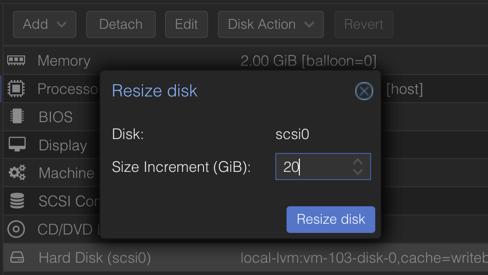

I think I've mentioned this before, but I'm a big fan of Proxmox. It's a great piece of software
that allows me to run my homelab with ease and without the need to spend a lot of time on it.
It's also a great way to learn about virtualization and containers, as it has support for both.

Yet from time to I get to do some tasks that are not that straightforward, and I tend to forget
how to do them. One of these tasks is expanding an existing disk in Proxmox. This is a task that
I've done a few times, but I always forget the steps. So, I decided to write a small cheatsheet
for myself, and maybe for others that might find it useful.

> The following steps assume that you
> - have a working installation of Proxmox
> - have both a virtual machine and a disk attached to it
> - you are able to access the virtual machine using SSH and have administrative permissions

## Resizing the disk

In the **Hardware** settings of your VM, select the disk you want to resize and from the navigation
bar, hit Disk Action > Resize.
Next, specify the storage that's going to be added to the disk and hit **Resize disk**.



> In my case, I incremented the `scsi0` disk with **20GB** of SSD storage.

## Resizing the partitions

After resizing the disk, the changes are not visible to the OS. To make them visible, we need to
resize the partition and the filesystem.

First, check the disks and partitions by running:
```shell
$ lsblk
NAME                      MAJ:MIN RM   SIZE RO TYPE MOUNTPOINTS
sda                         8:0    0    50G  0 disk
├─sda1                      8:1    0   953M  0 part /boot/efi
├─sda2                      8:2    0   1.8G  0 part /boot
└─sda3                      8:3    0  27.3G  0 part
  └─ubuntu--vg-ubuntu--lv 252:0    0  27.3G  0 lvm  /
```

As you can see, the disk has been resized, but the partition is still the same size. In my case,
I want to resize the `sda3` partition to fill the entire disk and to do that, I'm going to use
`cfdisk`.

```shell
$ sudo cfdisk
```

In the interactive menu, select the partition you want to resize and hit **Resize**. Then, select
the **Write** option to write the changes to the disk.

Next, we need to resize the physical volume and the logical volume by running:

```shell
$ sudo pvresize /dev/sda3
$ sudo lvresize -v -l +100%FREE /dev/mapper/ubuntu--vg-ubuntu--lv
$ sudo resize2fs /dev/mapper/ubuntu--vg-ubuntu--lv
```

## Conclusion

And that's it! The disk has been resized and the changes are visible to the OS. You can check the
changes by running `df -h` and you should see the new size of the disk.

```shell
$ df -h /dev/mapper/ubuntu--vg-ubuntu--lv
Filesystem                         Size  Used Avail Use% Mounted on
/dev/mapper/ubuntu--vg-ubuntu--lv   47G   26G   19G  58% /
```
