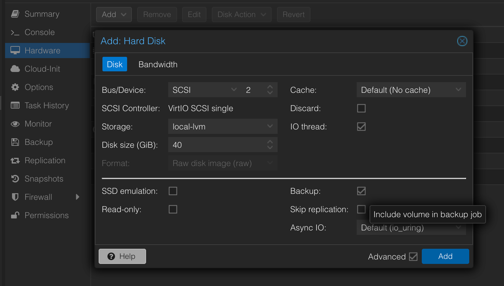

Almost my entire homelab being ran on Proxmox VE, I often run into VMs either requiring persistent storage or, worse, more disk space.
Therefore, in this article we'll explore the process of adding a new disk to a Proxmox virtual machine and making it accessible within the VM.

> The following steps assume that you
>
> - have a working installation of Proxmox
> - have both a virtual machine and a Thinpool LVM on the same node
> - you are able to access the virtual machine using SSH and have administrative permissions

## Adding storage in Proxmox

In the **Hardware** settings of your VM, add a new **Hard Disk** from the existing **LVM storage**.


Make sure the Backup option is either checked or not, based on your requirements. In my case, I follow a pattern where:

- **if the disk will be storing configuration data** or data that is used by services that do not have backup capabilities, **I do enable Backups for the specific volume**
- if the services storing data to the disk **have the ability to backup their data built-in**, **I prefer going that way** as it is generally more reliable and less error-prone and therefore disabling the Backups option in Proxmox

If everything goes right, you should see your disk added to the VM in the Summary section.

## Configure storage

Next we'll need to create the mount point, partition the drive and create the mount configuration.

**Create the mount point** _(here I always tend to choose /data for consistency, unless the service using it does not allow this configuration)_. This can be done by running

```shell
smuraru@citadel:~$ sudo mkdir /data
```

Find the disk either by the uuid or by it's size _(in VMs with just a few disks of different sizes it's easier to find it by size, yet one there are at least 2 disks with the same size that becomes difficult)_

```shell
smuraru@citadel:~$ sudo fdisk -l
Disk /dev/sdb: 40 GiB ...
```

Then format to `ext4` by running the following command

```shell
sudo mkfs.ext4 /dev/sd{YOUR_DISK}
```

And finally, mount it by adding the following line in `/etc/fstab`

```shell
/dev/sd{YOUR_DISK}  /data    auto nosuid,nodev,nofail,x-gvfs-show 0 0
```

and running `sudo mount -a`.

## And ...that's it

You should have your disk mounted and ready to be used at `/data`

```shell
smuraru@citadel:~$ df -ah /data
Filesystem      Size  Used Avail Use% Mounted on
/dev/sdb         40G   24K   38G   1% /data
```
